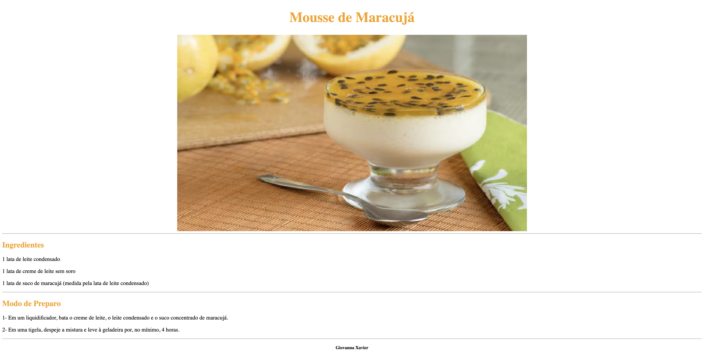

# Receita - Mousse de Maracujá

---
## Sobre
Bem-vindo ao meu projeto escolar, onde compartilho uma deliciosa receita de mousse de maracujá! Este site foi desenvolvido para apresentar uma receita simples e saborosa, perfeita para qualquer ocasião. O objetivo deste projeto é colocar em prática os conhecimentos adquiridos sobre as linguagens de marcação , HTML, CSS e markdown, durante o curso Técnico em Desenvolvimento de Sistemas do [SENAI Jandira](https://sp.senai.br/unidade/jandira/).

---

## O que você vai encontrar
Neste site, você encontrará:

- Ingredientes: A lista completa dos ingredientes necessários para preparar a mousse.
- Modo de Preparo: Instruções passo a passo para garantir que sua mousse fique perfeita.
- Dicas: Sugestões para personalizar a receita e obter o melhor resultado.

---

## Tecnologias utilizadas
- HTML
- CSS
- Markdown
- Git

---

## Autor

- [Giovanna Xavier](https://www.linkedin.com/in/giovanna-xavier-978538241/)